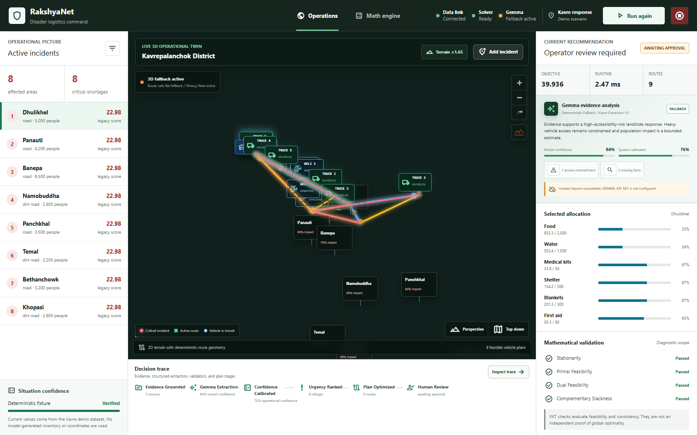

# RakshyaNet

**Evidence-grounded route intelligence for disaster logistics in Nepal.**

Gemma reads contradictory field reports and turns them into a schema-validated,
evidence-cited analysis, then drives a deterministic terrain-constrained route
engine through **native function calling**. A human authorizes the resulting plan
before anything is treated as approved — Gemma never allocates stock, never
chooses a vehicle, and never dispatches.

| | |
|---|---|
| **Hackathon** | Build With Gemma: Margadarshan — Kathmandu University Mathematics Students' Club |
| **Track** | Route Intelligence |
| **Model** | `gemma-4-26b-a4b-it` (hosted, via the Gemini API) |
| **Stack** | FastAPI + Pydantic · React + Vite · MapLibre · Three.js · SciPy |



---

## The problem

When a landslide closes a road in Sindhupalchok, the first reports are a police
radio call, a municipality WhatsApp message and a weather bulletin — and they
disagree. One says heavy vehicles cannot pass; another says motorcycles can.
Nobody knows how many households are cut off. A dispatcher has to commit a
helicopter, and there are four for the whole country.

Averaging those reports into one number is not a neutral act. Deleting a corridor
that motorcycles can still use strands a district. So relief coordination is two
stacked problems: **interpretation** — what do these disagreeing reports actually
establish? — and **spatial reasoning** — which vehicle reaches whom, over which
corridor, before it matters.

RakshyaNet is the layer between those reports and that decision.

---

## Quickstart

Prerequisites: **Python 3.10+** and **Node.js 18+**.

```bash
# Install
python -m pip install -r requirements.txt
cd frontend && npm ci && cd ..

# Configure (optional — the system runs without a key, see below)
cp .env.example .env        # then set GEMMA_API_KEY
```

Run the two processes:

```bash
# Terminal 1 — backend, port 8000
python backend/main.py

# Terminal 2 — frontend, port 5173
cd frontend && npm run dev
```

Open <http://localhost:5173>. Interactive API docs at <http://localhost:8000/docs>.

**Without a key it still runs.** If no hosted key is usable, or if a hosted
response fails schema or grounding validation, the system falls back to a
deterministic offline provider that obeys the same grounding rules — and the
interface says so in the header rather than hiding it. Three provider states are
shown and never collapsed: *not yet run*, *hosted model*, *declared fallback*.

Three pre-flight checks that tell you the demo-critical paths are alive:

```bash
curl -s http://127.0.0.1:8000/api/gemma/status          # key_pool.available_now >= 1
curl -s http://127.0.0.1:8000/api/optimization/tools    # declared function schemas
curl -s http://127.0.0.1:8000/api/optimization/baseline # naive-baseline comparison
```

A fuller operator walkthrough — every feature, in the order the interface is
designed to be used — is in **[HOW_TO_USE.md](HOW_TO_USE.md)**.

---

## How it works

The interface is four numbered stages, and the pipeline runs in the same order.

```text
POST /api/optimization/run   (or /orchestrate, where Gemma drives)
  → evidence loaded with provenance, source category, reliability, freshness
  → prompt-injection screening — report text is data, never instruction
  → Gemma extracts a schema-validated analysis; every non-null field cites
    the evidence IDs that support it; unsupported fields return UNKNOWN
  → grounding validation (numeric literal check, claim-overlap check,
    substring check) + deterministic system-confidence calibration
  → deterministic engine: urgency ranking → capability- and closure-filtered
    routing → capped proportional allocation → continuous fairness comparison
    → scoped KKT feasibility diagnostics
  → immutable versioned run + versioned WebSocket events
  → operator approves or rejects; approval is snapshot-token checked
```

| Stage | What it shows |
|---|---|
| **1 · Operations** | Terrain map over the fixture road graph, incident list, five bundled scenario timelines, mission clock (locked until a plan is authorized) |
| **2 · Gemma evidence** | The extracted analysis with citations, the UNKNOWN track, contradictions shown side by side without picking a winner, the function-call panel, and the literal prompt/reasoning/response |
| **3 · Math lab** | Route manifest, allocation convergence, KKT diagnostics, and the naive-baseline head-to-head |
| **4 · Review & authorize** | The plan under authorization, server-side approval blockers, override acknowledgement with rationale, decision receipt |

**Where the mathematics lives** (`backend/algorithms/`, `backend/services/`):

| Module | What it does |
|---|---|
| `urgency_calculator.py` | Unmet need × criticality × time escalation `T(t) = 1 + 0.5(e^{0.3t} − 1)`, plus a survival-threshold penalty that dominates proportional shortfalls |
| `vrp_solver.py` | Haversine air corridors; capability- and closure-filtered Dijkstra for ground legs with edge cost `d_e(1 + 0.06·max(0, τ_e − 1))`; full-tour fuel feasibility; ≤ 2 stops per asset |
| `nash_solver.py` | **Capped proportional allocation** with a normalized convergence residual. The filename is historical — this is *not* a strategic equilibrium, and the API response says so in its `interpretation` field |
| `social_welfare_optimizer.py` | SLSQP on `max Σ αᵥ log(1e-6 + cᵥ)` — a continuous fairness *comparison only*, never substituted into dispatch, because it ignores vehicle integrality |
| `kkt_verifier.py` | Scoped feasibility and consistency diagnostic, with honesty flags in the payload |
| `baseline_service.py` | The documented naive baseline, head to head |
| `gemma_service.py` | The extraction boundary: grounding checks, citation requirement, operational-authority screen |
| `gemma_orchestrator.py` | Declared function schemas, the multi-turn loop, and argument validation |

Full equations and their stated limits: **[MATH.md](MATH.md)**.
Algorithms as implemented, plus execution contracts: **[ALGORITHMS.md](ALGORITHMS.md)**.

---

## The two Route Intelligence track requirements

Both are demonstrable in the running system, not merely described.

### 1. Native function calling

Gemma decides *which computation the engine runs*. Press **Let Gemma run the
engine**, or:

```bash
curl -s http://127.0.0.1:8000/api/optimization/tools | python -m json.tool
curl -s -X POST http://127.0.0.1:8000/api/optimization/orchestrate \
     -H 'Content-Type: application/json' -d '{"scenario_id":"nepal-national-demo"}'
```

Two functions are declared to the model (a third, imagery verification, is off by
default — see Limitations):

| Function | Purpose |
|---|---|
| `list_corridor_status()` | Returns every corridor in the road graph, so any corridor Gemma names provably exists |
| `run_optimization(analysis_id, blocked_edge_ids, time_elapsed_hours, rationale)` | Runs the deterministic engine and returns a plan awaiting human approval |

Every argument is validated **before** the engine runs: `analysis_id` must be the
analysis opened for this turn; every blocked corridor must exist in the terrain
graph, so the model cannot invent a road closure; `time_elapsed_hours` must fall
in 0–72; and the free-text rationale is screened for allocation, dispatch and
approval language. A rejected argument is returned to the model, not executed.
The UI shows the raw arguments the model produced, whether they passed
validation, and what the engine actually ran.

*The moment worth showing:* on the bundled evidence the police report says heavy
vehicles cannot pass but motorcycles can. Gemma calls `list_corridor_status`,
then calls `run_optimization` with **`blocked_edge_ids: []`** and a rationale
explaining that the corridor is restricted but not established as impassable. It
declined to delete a usable corridor on contradictory evidence.

Implementation: `backend/services/gemma_orchestrator.py`.

### 2. A documented naive baseline

**Definition:** *shortest-path-only — no terrain weighting, closures ignored.* It
is the same engine with two behaviours switched off (`terrain_weighting=False`,
`honour_closures=False`), so it is not a strawman: it shares the road graph, the
Dijkstra search, the vehicle capability/capacity/fuel constraints, the urgency
model and the allocation. Only the terrain reasoning is removed.

**Metric:** executable routes after a corridor on the plan closes. A route through
a closed corridor is not slower — it cannot be driven.

**Measured**, on the national scenario, closing `east_west_bharatpur_nepalgunj`
(which carries every ground route):

| | Naive | RakshyaNet |
|---|---|---|
| Routes through the closed corridor | 5 | **0** |
| Executable routes | 4 / 9 | **9 / 9** |
| Fleet distance | 9,782 km | 10,563 km (+8.0 %) |
| Fleet time | 11,290 min | 12,462 min (+10.4 %) |

All five trucks are stranded in the naive plan. RakshyaNet re-plans around the
closure and keeps every route executable, for 8 % more distance.

**A measured negative result we report rather than hide:** on this 13-corridor
network, terrain-difficulty weighting **changes no path at all** — all nine routes
keep an identical edge sequence with it disabled. The corridors are too sparse for
the weighting to ever flip a choice. The entire measured advantage comes from
closure-aware re-planning, not from terrain cost inflation. This is stated in the
code, in the API response, and in the UI.

Implementation: `backend/services/baseline_service.py`. Run it live at
`GET /api/optimization/baseline`, or from the **Math lab** tab.

---

## Verification

```bash
python -m pytest backend/tests -q

cd frontend
npm run lint
npm run build
npx playwright test        # end-to-end + axe accessibility + responsive
```

Current verified state, from a full local run:

- **861 backend tests pass**, zero failures — `861 passed, 73 warnings in 711.98s`.
- `npm run lint` exits 0 with no warnings (`--max-warnings 0`).
- The Vite production build succeeds.
- Playwright end-to-end, accessibility and responsive suites are shipped in
  `frontend/tests/`; the frontend is under active change, so no test count is
  quoted here — run the suite for the current figure.

This repository has **no CI**. Verification is the commands above, run locally.
One of them is worth calling out: `frontend/tests/mission-control.spec.js` pins
`data-timeline-checkpoint-max-error` at `0.000000` — it walks every stop, compares
the rendered vehicle position at that stop's `eta_minutes` against the stop's own
coordinates, and requires zero error. The map is not an animation loosely inspired
by the plan; it is the plan.

Replay all five bundled incident timelines:

```bash
python scripts/replay_scenarios.py
```

---

## What is guaranteed, and what is not

Worth stating up front, because the surrounding vocabulary — *optimizer*, *KKT*,
*social welfare* — invites the wrong assumption.

**The dispatch problem is NP-hard.** It is a capacitated vehicle-routing problem
over a heterogeneous fleet with capability, payload and endurance constraints;
it contains the travelling salesman problem. No fast algorithm is known that
returns a provably optimal plan for it, and unless P = NP none exists.

**So RakshyaNet solves it with a heuristic, on purpose.** A greedy
urgency-ordered assignment, then a nearest-neighbour tour, over a graph already
filtered for vehicle capability and active closures. An exact solve is not the
right engineering trade for a tool whose output a dispatcher has to act on in
the next ten minutes — and saying so plainly is a strength of the submission,
not a hole in it.

| Guaranteed | How |
|---|---|
| **Feasibility** | Every dispatched route respects payload mass, fuel endurance, terrain capability, depot stock and the active closure set. A run failing route feasibility cannot be approved — the backend refuses it |
| **Determinism** | Same inputs, same plan. No sampling, no unstable tie-breaks |
| **Traceability** | Every number decomposes to its inputs — which report produced which signal, which edges produced which distance |
| **Reproducibility** | Runs are immutable snapshots, replayable from fixtures via `python scripts/replay_scenarios.py` |

| Not guaranteed | Status |
|---|---|
| **Global optimality of the route plan** | Not claimed, not certified, no approximation ratio |
| **Optimality gap** | **Unmeasured.** The instance is small enough to solve exactly as a MILP/CP-SAT model; doing that and reporting the gap is roadmap |
| **Optimality of the allocation** | Capped proportional allocation is a rule, not an optimum |
| **What KKT covers** | A feasibility and consistency diagnostic on the *continuous* allocation — a separate, convex problem. Three of its four conditions hold by construction. It says nothing about the discrete routing decisions, and the payload says so: `independently_proves_optimality: false`, `applies_to_discrete_route_decisions: false` |

The full argument, including why not OR-Tools, is in
[docs/QAs.md §C](docs/QAs.md).

---

## Limitations — stated plainly

This section is deliberately specific. The track brief penalises inflated results,
and several of these are things the system could have quietly claimed instead.

- **Fixture data, not live feeds.** The road graph, fleet, inventory, evidence and
  scenario timelines are bundled deterministic fixtures, labelled as such in the
  interface (`Geospatial twin · fixture road graph`). Nothing here is a live
  government or agency feed.
- **The KKT panel is a feasibility diagnostic, not a proof of optimality.** Three
  of its four conditions hold by construction for any primal-feasible allocation;
  only primal feasibility carries information. The API ships
  `independently_proves_optimality: false` and
  `applies_to_discrete_route_decisions: false` so this cannot be misread
  downstream. The UI never calls it a proof.
- **The allocator is not an equilibrium solver, and not an optimum.**
  `nash_solver.py` implements capped proportional allocation with need-cap
  redistribution — a deterministic *rule*, warm-started from the route
  allocation and iterated to a normalized residual below 0.01. The continuous
  log-utility comparison in `social_welfare_optimizer.py` is a fairness *candidate*
  only — it ignores vehicle integrality and route feasibility and is never
  dispatched.
- **Terrain weighting alone changes no path on this network.** The measured
  advantage over the baseline is closure-aware re-planning. See above.
- **Routing is a heuristic, deliberately.** The dispatch problem is a
  capacitated vehicle-routing problem over a heterogeneous, capability-
  constrained fleet — it contains TSP and is **NP-hard**, so no fast algorithm is
  known that returns a provably optimal plan. RakshyaNet uses a deterministic
  greedy urgency-ordered assignment plus a nearest-neighbour tour over a
  capability- and closure-filtered graph, and calls it a heuristic everywhere.
  The claim is not *"this is the best possible plan"* — it is *"this is a
  feasible, executable, terrain- and closure-aware plan, produced fast enough to
  act on, in which every number is traceable"*. See
  [What is guaranteed](#what-is-guaranteed-and-what-is-not).
- **The optimality gap is unmeasured.** The bundled instance is small enough to
  encode exactly as a MILP/CP-SAT model and solve; reporting
  `(greedy − exact)/exact` on the coverage objective is roadmap, not a number we
  have. No approximation ratio is claimed. The two-stops-per-asset cap is itself
  a heuristic restriction of the search space.
- **Time escalation is uncapped**, so very large elapsed-time inputs can dominate
  the urgency score. Inputs must represent the intended operational horizon.
- **The satellite imagery tool is off by default.** With the flag off the
  declaration is never sent to Gemma, the endpoints 404, and the interface renders
  nothing about imagery — that is what a judge cloning this repository sees. When
  enabled, it is a **land-cover classifier**, not a flood detector, and the tiles
  are real Sentinel-2 patches from the published **EuroSAT** benchmark **bound to
  Nepali corridors for demonstration** — they are *not* imagery of those corridors,
  and every surface says so. No accuracy figure is claimed. A corridor whose only
  supporting evidence is an imagery record **cannot** enter `blocked_edge_ids`;
  that is enforced in code and covered by a test.
- **The orchestration path takes ~30–60 s** because it makes several real model
  round trips.
- **Terrain tiles need network access**; the map falls back to a schematic view
  without it.
- **Nepali/Devanagari evidence is not yet supported**; all bundled reports are in
  English.
- **Not a deployment.** No authentication, role-based access, audit retention,
  durable storage, or agency integration. Run history is process-local.

---

## Documentation

| Document | What it is |
|---|---|
| [HOW_TO_USE.md](HOW_TO_USE.md) | Operator walkthrough — every feature, in demo order |
| [MATH.md](MATH.md) | Authoritative mathematical model and its stated limits |
| [ALGORITHMS.md](ALGORITHMS.md) | Algorithms as implemented, and execution contracts |
| [docs/architecture.md](docs/architecture.md) | System architecture |
| [docs/api.md](docs/api.md) | REST and WebSocket contracts |
| [docs/gemma-integration.md](docs/gemma-integration.md) | The Gemma boundary in detail |
| [docs/hitl-safety.md](docs/hitl-safety.md) | Human-in-the-loop safety invariants |
| [docs/current-limitations.md](docs/current-limitations.md) | Limitations, in full |
| [docs/CONTEXT.md](docs/CONTEXT.md) | Contributor context: repo map, invariants, truthfulness rules |
| [docs/QAs.md](docs/QAs.md) | Judge Q&A, including the hard questions |
| [docs/WALKTHROUGH.md](docs/WALKTHROUGH.md) | Full demo walkthrough |
| [docs/demo-script.md](docs/demo-script.md) | Short demo click-path |

---

## Claims this project does not make

Repeated here because they are easy to assume from the surrounding vocabulary:

- It does **not** compute a Nash equilibrium.
- It does **not** prove, certify, or guarantee global optimality. The routing
  problem is NP-hard and the solver is a heuristic — stated, not hidden.
- It does **not** report an optimality gap or an approximation ratio; neither
  has been measured.
- It does **not** consume live data.
- It does **not** dispatch anything. Gemma proposes; a human authorizes.

---

## License and attribution

Built for Build With Gemma: Margadarshan, 2026. Bundled Nepal geography, fleet and
evidence fixtures are constructed demonstration data. EuroSAT imagery tiles are
from the published EuroSAT benchmark dataset and are used for demonstration only.
